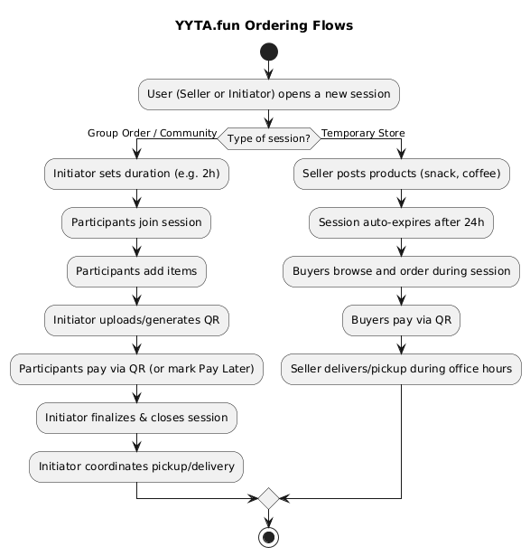
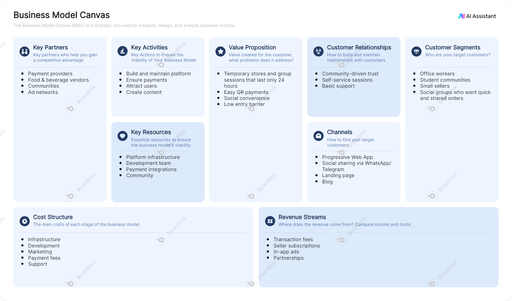

# YYTA.fun Monorepo

YYTA.fun (short for "Yang Tau Tau Aja", pronounced **YETA**) is a social marketplace experiment.
It allows anyone to create temporary stores, publish products for a limited time, or start a group order session where friends, colleagues, or communities can join in.

The project is designed to explore modern patterns such as microfrontends and microservices, while keeping the core idea simple:
**short-lived, social, and session-based commerce.**

---

## Project Vision

Unlike traditional marketplaces, YYTA.fun emphasizes:

* **Ephemeral commerce**: products and sessions exist only for a limited time (e.g., 24 hours) and must be republished or reopened.
* **Social interaction**: sessions are designed for group orders, like when someone at the office wants to grab snacks or coffee and invites others to join.
* **Decentralized contribution**: multiple small teams can own different parts of the system, with independent apps and services.

---

## Monorepo Structure

This repository follows a simple split between **frontend apps** and **backend services**.
Each service or app is self-contained, with its own README and scope.

```
root/
│
├── frontends/         # Microfrontends
│   ├── landing-app/   # Public landing page
│   ├── blog-app/      # Blog and editorial content
│   ├── ads-app/       # Promotions and advertisements
│   ├── product-app/   # Product listings with timed publishing
│   └── session-app/   # Group sessions and ordering
│
└── backends/          # Microservices
    ├── user-service/    # User profiles and accounts
    ├── product-service/ # Product lifecycle
    ├── session-service/ # Session lifecycle
    ├── order-service/   # Order management
    ├── payment-service/ # Payments and QR handling
    ├── ads-service/     # Ads campaign data
    └── blog-service/    # Blog and editorial management
```

### Links to Active Projects / Development

* **Frontend: Landing Page (Astro)** → [frontends/landing-app](./frontends/landing-app)
* **Frontend: Product App (Vue + Vite)** → [frontends/product-app](./frontends/product-app)
* **Backend: Product Service (Go)** → [backends/product-service](./backends/product-service)

---

## Guiding Principles

1. **Clarity**: Each service has a well-defined scope.
2. **Independence**: Teams can build, run, and deploy their service or app separately.
3. **Scalability**: The design anticipates growth from a prototype into a full distributed system.
4. **Experimentation**: The project is a playground for ideas like microfrontends, service decomposition, and PWA-first design.

---

## User Journey Examples

To better illustrate the concept, here are several study cases:

### 1. Group Order (Nitip)

[Case Study → nitip-session](./business/examples/nitip-session)

* **Alice** opens a new *coffee session* in her office. The session is set to expire in 2 hours.
* **Bob** and **Carol** see the session notification and join it, each placing their own orders.
* **Alice** closes the session when the deadline is reached.
* Everyone pays individually via QR code.
* Alice picks up the coffee and delivers it to the group.

### 2. Temporary Store (Friends Selling)

[Case Study → bantu-teman](./business/examples/bantu-teman)

* **David** sells homemade snacks at work. He opens a *snack session* in the app that lasts for 24 hours.
* Colleagues browse available items and place orders within that time frame.
* At the end of the day, the session automatically expires.
* David receives the orders and payments, then delivers snacks during office hours.

### 3. Community Ordering

[Case Study → marketplace-daily](./business/examples/marketplace-daily)

* A **student community** uses YYTA.fun to organize a *group lunch order*.
* One person opens the session and shares it with the group.
* Dozens of students join, each adding their meal preferences.
* The order is finalized, and one student coordinates payment and pickup.

---

## Main Flow Diagram



These flows demonstrate the essence of YYTA.fun:
**social commerce, limited-time sessions, and group collaboration.**

---

## Business Model Canvas



---

## Current Status

This repository is in its **concept and design phase**.
At this stage, each service is documented and outlined with its responsibilities, but technical implementation is ongoing in the following active projects:

* **Frontend: Landing Page (Astro)** → [frontends/landing-app](./frontends/landing-app)
* **Frontend: Product App (Vue + Vite)** → [frontends/product-app](./frontends/product-app)
* **Backend: Product Service (Go)** → [backends/product-service](./backends/product-service)
